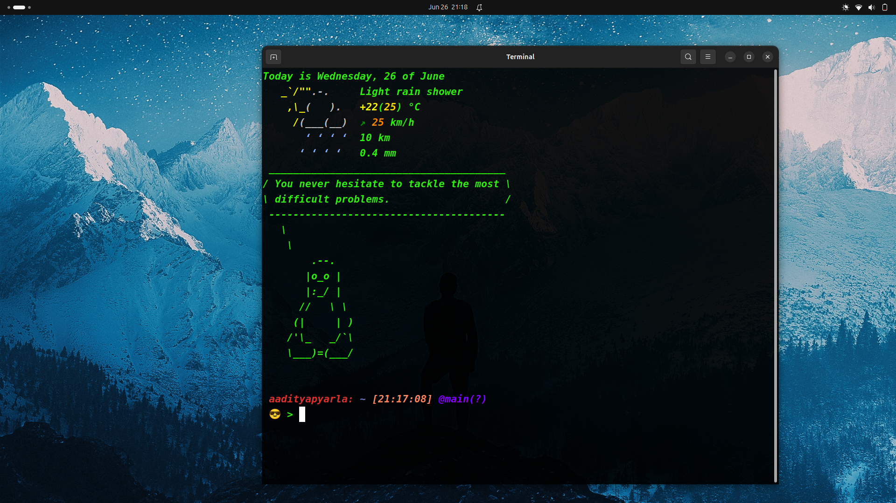

# DOTfiles

This is the best ever config for your Productivity.

This makes your terminal look and feel like this :



##  Features

- It lets you know the current Date and Time.
- It gives you a ASCII art formatted weather forecast at time of ever new login session.
- It throws some facts in ASCII art making it look interactive
- It has a customized prompt of amazing contrast colours.
- It indicates the version control details powered by git. 

## Installation

```sh
cd ~
git clone https://github.com/aadityapyarla1983024/dotfiles.git
```

> **Note:** Your changes or modifications made to .bashrc may be overwritten by the above command.


> **Note:** Make sure to delete the .git folder to avoid git pormpt everywhere. Since if you not then it will give a prompt at every folder of the git repo located at your home folder.

```sh
rm -rf .git .gitignore .gitconfig
```


## Thanks To

- [w3cj](https://github.com/w3cj/dotfiles) for the cusomization.
- [taringamberini](https://github.com/taringamberini/vcs-bash-prompt) for the version control details.
